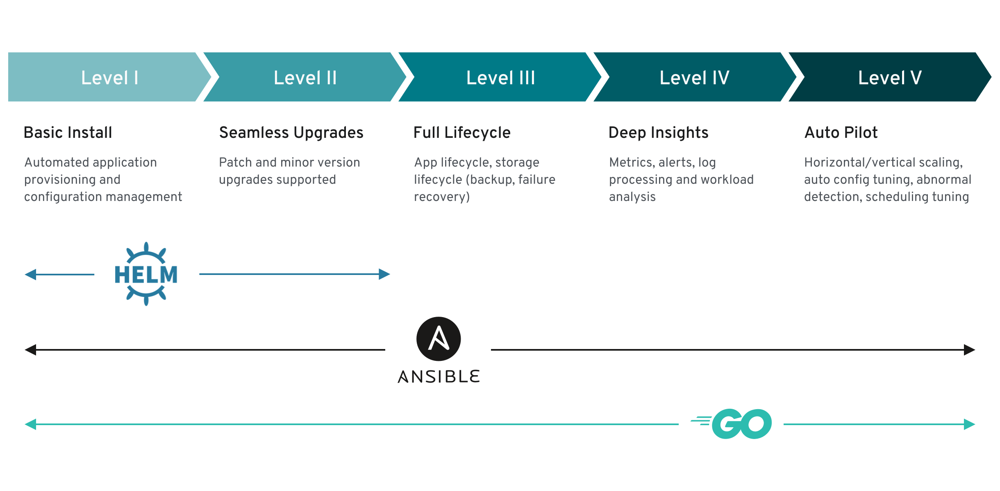

# Demo Operator for 3 Tier App

This app will be build on branches showing each tier of operator level for the app, based on 
https://sdk.operatorframework.io/docs/overview/operator-capabilities/

## Setup Commands
### Core commands to get the skeleton
- mkdir operator && cd operator
- go mod init github.com/krackenservices/3tierappoperator
- kubebuilder init --owner "Ryan McLean" --domain k8s.krackenservices.com
- kubebuilder edit --multigroup true

## Starting to be more specific about the operator
- kubebuilder create api --group api --version v1alpha1 --kind MyCustomThing
- kubebuilder create api --group core --version v1 --kind Pod